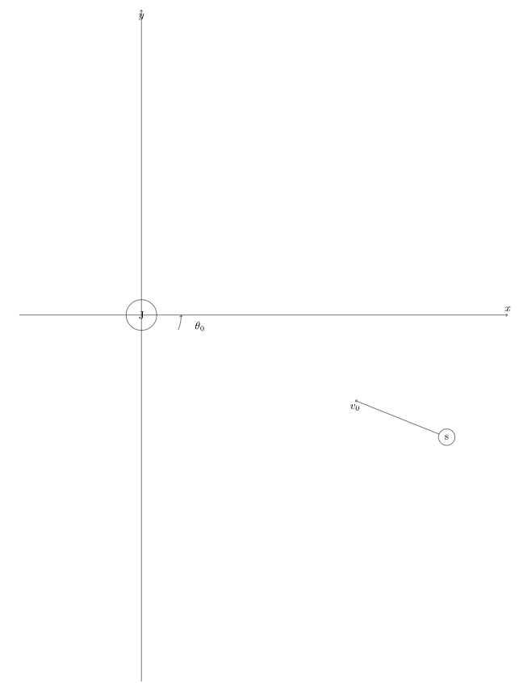
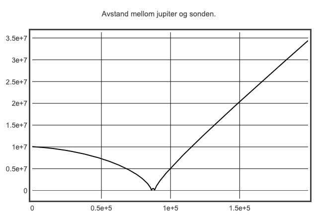
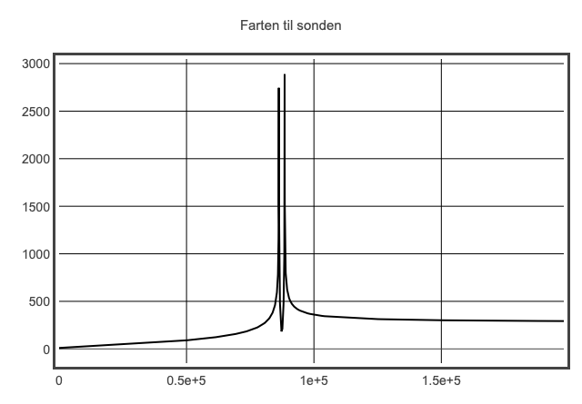

# week41
***
1. [Oppgaven](#oppgaven)
2. [Startbetingelser](#startbetingelser)
3. [Resultater](#resultater)
    1. [Animasjoner](#animasjoner)
    2. [Plots](#plots)

### Oppgaven

***
### Startbetingelser

- 
- 
- 
- 
- Bruker [Newtons gravitasjonslov](https://no.wikipedia.org/wiki/Newtons_gravitasjonslov): 

***
### Resultater

##### Animasjoner

##### Plots

